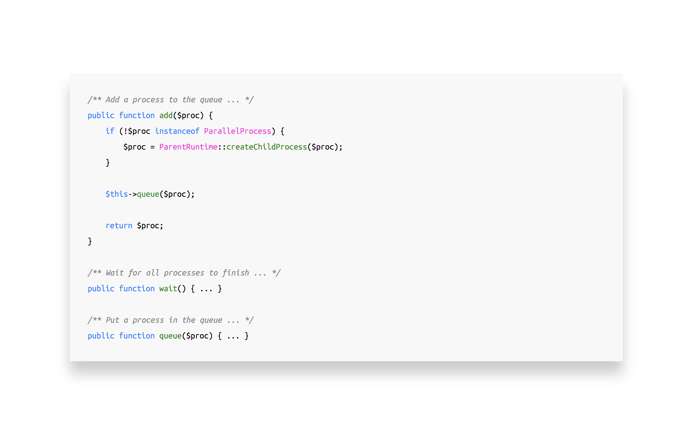
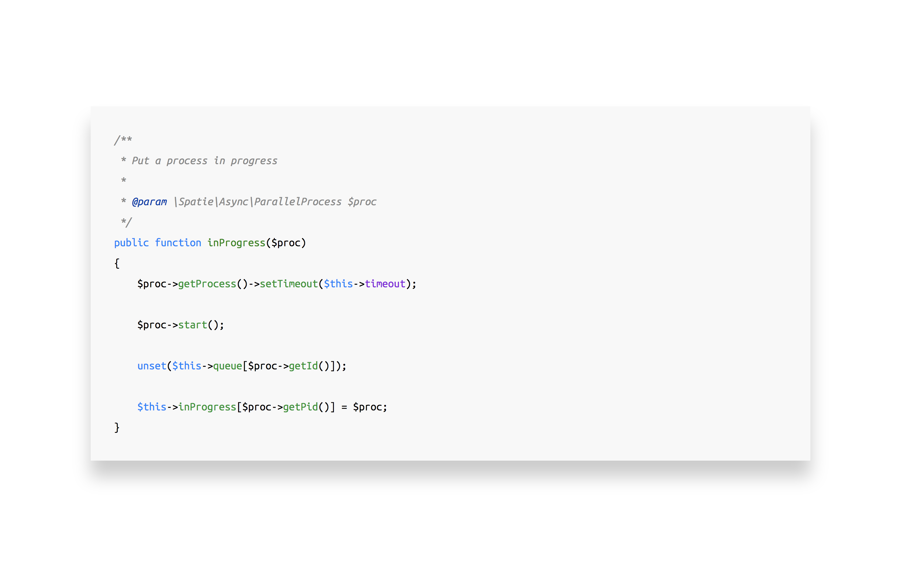
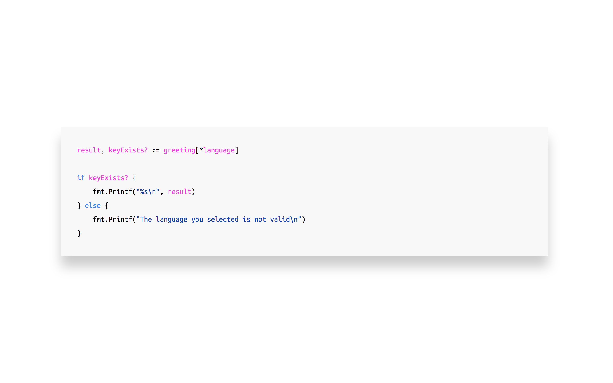
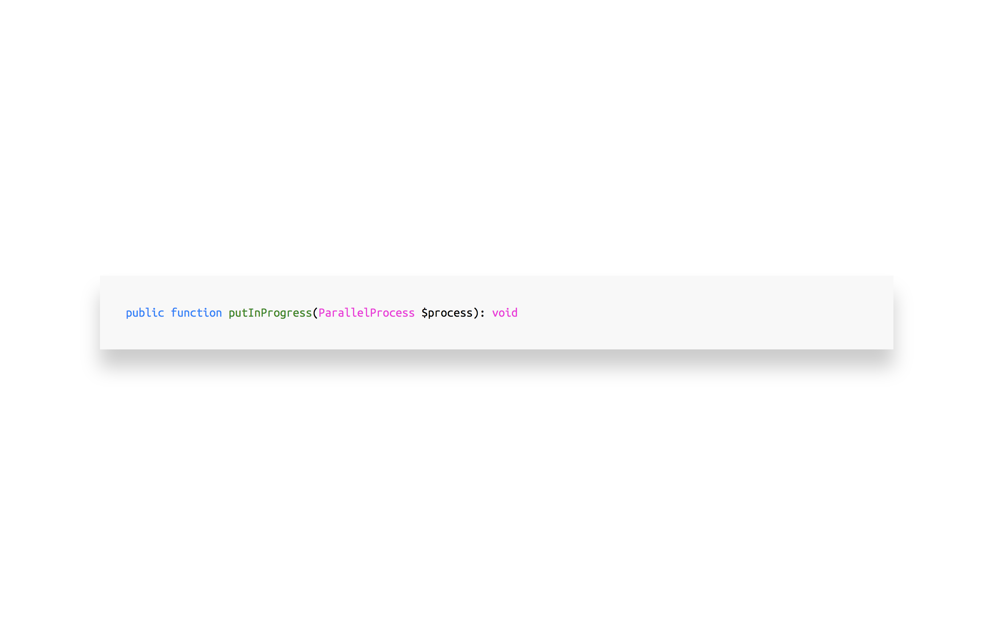

---

# Visual perception of code

^ Before we start, just a quick introduction about me.

---

## Brent:

### web developer at spatie
### @brendt_gd
### stitcher.io

^ My name is Brent

^ I'm a web developer at Spatie, I work on PHP and Laravel projects and do some open source.

^ You can find me on Twitter

^ I have a blog called stitcher.io on which I write about PHP and programming in general.
A lot of the things I'll talk about today are also written down there.

---

# Visual perception of code

^ Today's talk will be about visual perception of code. I'll argue that **how** your code **looks** will have an immense influence; not only on yourself, but also on your colleagues and friend-developers.

^ And to be honest, it is a difficult topic to talk about, for many reasons

---

## Visual perception of code:

### Opinionated and personal
### Controversial
### Out of your comfort zone

^ For one, "how something looks": beautiful and structured or not, is very subjective. It's an opinionated and personal thing to talk about.

^ Controversial: there are standards, is it ok to argue against them?

^ And third, it's a topic that, for many people, is out of their comfort zone. People are used to *their way* of writing *their code*, and there often doesn't seem to be the need to change that.

^ However

---

## Visual perception of code:

### Studies and facts
### Common sense and reasoning

^ I'll also mention studies and facts today. Trying to prove to you that's it's more than just an opinion.

^ I hope that, by reasoning together, we can touch some topics you haven't thought about before in this way, and can broaden your thinking.

---

## The problem

^ Before diving into these topics, we have to take a look at the exact problem.

---

## Read vs Write

^ As professional programmers we're writing a lot of code; but we're reading and scanning even more.

^ To name a few obvious examples: reading documentation, doing code reviews or finding your way in legacy codebases

^ But our own code also fits in this list. Ask yourself how many minutes a day you're actually typing code, and compare that to the amount of time spent reading and figuring things out, trying to understand what's actually written.

---

## Reading and scanning:

### Requires attention

### Requires "human memory space"

^ This reading and scanning requires a part of your attention, it puts a load on your brain. It's a thing you need to focus on.

^ I like to put it like this: reading and scanning code requires a certain amount of human memory space. And that memory can't be used for anything else.

---

## "Human memory space"

### **Cognitive load**[^1]

[^1]: *stitcher.io/cognitive-load*

^ As an official term, this "human memory space" is also called cognitive load.

^ A formal definition is that "cognitive load refers to the total amount of mental effort being used in the working memory of your brain"

^ The more we can reduce this cognitive load, the more space there is to focus, on for example, "application logic". The thing your clients actually pay you to do.

---

## Visual perception of code

^ There are many things we can do to reduce this cognitive load, to improve the visual perception of code.

---

## Aestetics

^ At first: we're going to look at pure aestetics; these are changes you can make on your screen.

^ This is the easy part, because it has nothing do do with changing the code itself.

---

## Fonts

^ We'll start with fonts. Let's take a look at an example.

---

^ During this talk, we'll mainly work with this piece of code. It's taken from a package I wrote at Spatie.

^ Currently, the font configuration in this example is the following

---

## Fonts

### Courier New 
### 14pt
### Line height of 1.1em

^ Let's review it once more.

---

^ Now I'm going to propose another font configuration.

---

^ Now the text is much more readable, you don't have to squint your eyes as much as before. Easier to read text reduces cognitive load. Because you don't have to focus as much on the reading itself.

^ We're freeing up memory space!

^ If you're interested in this particular font configuration, this is it.

---

## Fonts

### Ubuntu Mono
### 18pt
### Line height of 1.8em

^ But of course, you're free to work out what's best for you.

^ But notice especially how much larger the font size and line height are.

---

^ Some of you might be thinking that there's less code on the screen, and that you don't like that.

^ But let's think about that for a moment.

---

## More space = ?

^ What's the value of having more space?

---

## More space = more things to see

^ You could say there's more things to see.

^ But in reality, being able to **see** more code on your screen, doesn't mean you're able to understand what's on that screen any faster or better. It's actually more difficult to know where to focus, because there's much more points to focus on.

---

## More things to see = more cognitive load

^ Being able to **see** too much code means it **increases** cognitive load

^ This brings us to the second visual change I personally use all the time.

---

## Code folding

^ And that's code folding.

^ Let's take a look at the example, the same code again.

---

^ As you can see, more methods are visible on the screen, but their implementation is hidden.

^ Code folding has a few advantages:

---

## Code folding

### Method signatures close by
### Implementation hidden
### Colour coded structure of classes

^ You can keep the method signatures close by, but their implementation hidden until needed. That's less things screaming for your attention.

^ Also; you probably work with an IDE or editor which can list the "structure" of classes, to quickly jump to. You can see that same structure very easy with folded methods, but with the added benefit of colour coding. So it's easier to navigate.

^ If you're using code folding, there's one remark though:

---

## Code folding requires key bindings[^2]

[^2]: *stitcher.io/key-binding*

^ Key bindings are required.

^ For this to really work, you need proper key bindings to collapse and unfold, but also to jump between methods and whitespacing.

---

^ This is the current example with better fonts and code folding. There's one more change I want to propose to make this code easier to read.

---

## Colours

^ And that are colours.

^ This could very well be one of the more sensitive topics, but bear with me for a few minutes.

---

^ Instead of this, I propose to do:

---

^ This, a light theme

---

## Colours

### Studies [^3]
### Contrast !== brightness

[^3]: *Etienne Grandjean: Ergonomic Aspects of Visual Display Terminals*

^ Since the early rise of computers, people have been doing research on what colours are the easiest to work with on screens. For example, there's a guy called "Etienne Grandjean" who wrote a paper on this exact topic: Ergonomic Aspects of Visual Display Terminals

^ It turns out that dark text on a light background is easier to read than the opposite, because the dark parts automatically draw your subconscious attention.

^ Many people tell me that a light colour scheme hurts their eyes. It's important to note that the brightness of your screen isn't the same as the contrast of the text.

---

^ In this case for example, I'm using a color scheme created by Mozilla for their new dev tools. A lot a research went into picking these colours, to make them have very hight contrast. That doesn't mean that the brightness of your screen must always be a 100%. 

^ Light themes are actually much more easy to read on a dimmed screen compared to dark ones. It's the brightness that hurts your eyes, not the contrast.

^ I would really encourage you to just try it out for a week, I got used to a light theme in a few days, and since than never wanted to go back.

^ It's of course a little personal, I understand that; but remember: easier to read text, reduced cognitive load.

^ To recap:

---

## Aestetics

### Fonts and spacing
### Code folding
### Colours

^ In this first part, we looked at things you can do to make the code on your screen more readable. This was the easy part because no other people are affected by these changes.

^ Next up, we'll talk about the structure of code.

---

## Structure

^ As you can imagine, this the more difficult part, because now we're messing with things others are also affected by.

---

## Curly brackets

^ Let's talk about curly brackets first.

^ As web developers, you're probably aware that people don't read websites, they rather scan it. And that scanning usually happens from left to right, top to bottom.

^ The same can be applied to large pieces of code. You're not always reading every single letter; you're scanning for patterns.

^ The easier it is to find these patterns, the less time you spend looking around your code to find that one specific thing.

---

^ With scanning, and cognitive load in mind; can anybody tell me what could be wrong with this piece of code?

---

^ The argument list is the problem. There's a lot of important information there, pushed to the right.

^ And remember, we're approaching this from a visual perspective, we're not looking at the logic of the code itself.

^ So how do we solve this?

---

^ One solution could be structuring the argument list like this, pulling the arguments more to the left.

^ But this approach doesn't really scale when you're refactoring.

---

^ For example making this constructor a static constructor instead.

^ You can see the alignment breaking.

---

^ Another approach could be something like this, but now you're introducing several points of focus in your code.

^ I can visualise this by drawing some lines.

---

^ There's the function start and end, the first and third argument aligning with the method body, and the second and fourth don't align to anything.

^ Another issue with this approach is that's there's no real guideline on how to group arguments. Per 2? 3? What about an uneven number of arguments?

---

^ Moving on to what seems like the only consistent, yet easy to understand way of structuring the arguments.

^ Some of you might already see the problem arising, but I want to make this really clear. So let's replace all code with Xs to see its structure.

---

^ Can you see how difficult it is to spot where the argument list ends, and where the method body starts?

^ There's the curly bracket at the right indicating the end of the argument list, but the right side isn't where our focus is by default.

^ So it turns out, there's one true place where to put that curly bracket:

---

^ On a new line.

^ This visual boundary creates a pattern we can scan for.

---

^ This is the end result. 

---

## Kevlin Henney

^ And by the way, this example isn't my own; it's made by a guy called Kevlin Henney, he's a programmer and a writer and has a very good eye for these kind of visual patterns. So if you want to know more, definitely check him out.

---

## Visual Patterns

^ When you start focussing on visual patterns in your code, you'll discover that you're already using some. This is one of the most important reasons there's a style guide provided by the FIG: PSR-2 (PSR-12 is coming). 

^ But, most likely, there still are some places in your code where you don't activily look for patterns. And those are the places which take the longest time to search for specific things. So try to think about that the next time you're coding.

^ Try to recognise places in your code that could be better structured, making it easier to scan for patterns in them. And also talk about this with your team to make it consistent.

---

## Self documenting code

^ Moving on to the last two points, I want to let the code do most of the talking, so to speak.

^ You probably already saw the docblocks for each method in the examples.

---

^ This function "puts a process into progress".

^ You should ask yourself: is this doc block necessary? What information does it share we can't write in the code itself?

---

^ Nothing. It has no added value at all. 

^ This code should be type hinted instead of adding redudant doc blocks.

^ Type hints aren't enough to fully remove doc blocks, to have this "self documented" code

---

## Naming

^ You also have to name things correctly. A name is such a powerful tool, it can carry a lot of meaning and business context that you'd otherwise need documentation for.

^ Before making the last changes to our example code, let me quickly tell you a story.

---

### Go naming[^4]

[^4]: *https://speakerdeck.com/tpryan/go-for-php-developers*

^ At PHPBenelux this year, Terrence Ryan gave a talk called "Go for PHP developers" and he showed us this example.

^ He immediatly addressed a problem for the non-Go developers in the room: this code had very unclear names. So he changed it.

---

### Go naming[^4]

^ Afterwards I asked him why there was this naming convention in Go to make all variables as short as possible. He said "that's just the way the core team does it, and they enforce it during code reviews at Google". So naturally, those conventions were also used by the community.

---

### Variable Name Conventions in Go

^ Instead of choosing names which could be easily understood by humans, Go has this culture of making names as short as possible, without a good reason, besides "preference".

---

^ So what about our example? If a better name makes the code more readable, if it saves you a fraction of a second of brain time; and with cognitive load in mind; shouldn't we just use better names? Is there really an argument against it?

---

^ I personally don't think so.

^ For example, name the process variable actually `process` instead of `proc`; and let the method name actually say what it's going to do "put that process in progress"?

^ Be smart and skip the mental translation from abstract to concrete names. It's a burden every time you read your code.

^ When you name something, it always seems obvious to you at that moment. But does it still after a day? A week? Do you need doc blocks to explain what the code does? Or is it clear by its name? Not only to you, but also the ones who have to work in your legacy codebase once you're done?

---

## `UserCreated`

### Event, Mail or Notification?

^ Two more examples. Does this class mean a user was created, an event; 

^ or does it represent the mail that's sent out when that event happens, 

^ or maybe it's the name of a notification?

---

## `UserCreatedEvent` 

## `UserCreatedMail`

## `UserCreatedNotification`

^ Let's just skip the possibility for confusion alltogether, and use explicit names.

---

## `CreateUser`

### Command, HTTP request or Job?

^ The last one: is this a command to create a user; 

^ Is it a request class containing the validation rules?

^ or is it a job to create a user?

---

## `CreateUserCommand` 

## `CreateUserRequest`

## `CreateUserJob`

^ Again, let's not waste time thinking about this, spend your brain power on more important stuff.

---

## Structure

### Curly brackets
### DocBlocks 
### Names

^ That were a lot of things in a short amount of time. 

^ Like I said at the start of this talk: my goal was to make you think about cognitive load. 

^ I want to encourage you to start looking for patterns, aestetics, good names, and so on, in your own code.

---

## What about your code?

### #cleancode - @brendt_gd

^ Naturally, I'd love to see how that code looks.

^ I always enjoy looking over someones shoulder to see how they have configured their IDE, and how they write code.

^ If you're up for it, send me a screenshot of your code on Twitter!

---

## Thanks!

### @brendt_gd
### *stitcher.io/presentations*

^ With that being said, thanks for your attention!

^ If there are any questions or if you want to tell me I'm wrong: feel free to come talk with me, after my colleague Sebestian is done.

---