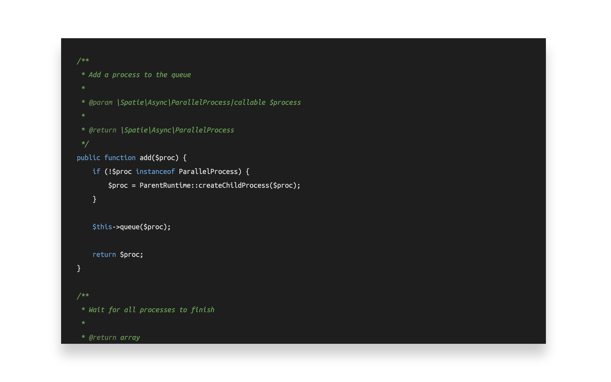
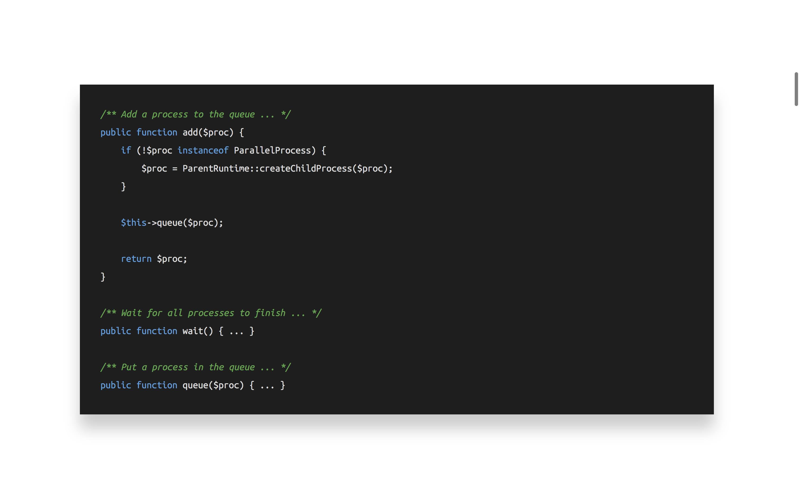
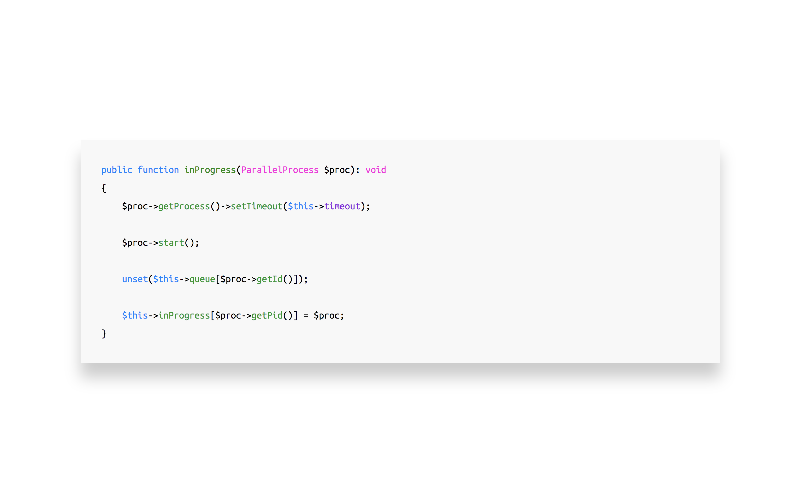

# Visual perception of code

^ Before we start, there are a few informational things I'd like to share.

---

## Brent:

### @brendt_gd
### web developer at spatie
### stitcher.io

^ You can find me on Twitter

^ webdev at spatie: Laravel websites and applications

^ I have a blog on which I write about PHP and programming in general.
A lot of the things in this talk today are also written down there: stitcher.io

---

# Visual perception of code

^ Today's talk will be about visual perception of code. I'll argue that **how** your code **looks** will have an immense influence; not only on yourself, but also on your colleagues and friend-developers.

^ And to be honest, it is a difficult topic to talk about, for many reasons

---

## Visual perception of code:

### Opinionated and personal
### Controversial
### Out of your comfort zone

^ For one, "how something looks": beautiful and structured or not, is very subjective. It's an opinionated and personal thing to talk about.

^ Controversial: there are standards, is it ok to argue against them?

^ And third, it's a topic that, for many people, is out of their comfort zone. People are used to *their way* of writing *their code*, and there often doesn't seem to be the need to change that.

^ However

---

## Visual perception of code:

### Studies and facts
### Common sense and reasoning

^ I'll also mention studies and facts today. Trying to prove to you that's it's more than just an opinion.

^ I hope that, by reasoning together with you, we'll touch some topics you might not have really thought about before.

^ The goal of this talk is not to convince you of my p.o.v

^ But rather, make you think about how you and others percieve code, and form or finetune your opinion from there.

---

## Professional developers who:

^ Before diving into solutions and opinions, we must know the problem.

---

## Professional developers who:

### Write code
### Read code

^ As professional developers, we're writing a lot of code; but we're also reading a lot, maybe even more.

^ There are things like reading documentation, doing code reviews, learning legacy codebases, tutorials, reading our own code, a few days or weeks after we wrote it..

^ Think about it: the more easy it is to read and understand the code, the text, itself; the more "human memory space" is free to focus on other things.

---

## "Human memory space"

### **Cognitive load**[^1]

[^1]: *stitcher.io/cognitive-load*

^ This so called "human memory space" is also called cognitive load.

^ A formal definition is that "cognitive load refers to the total amount of mental effort being used in the working memory of your brain"

^ The more we can reduce this cognitive load, the more space available to focus, on for example, "application logic". The thing your clients actually pay you for.

^ We'll be addressing this issue in two different ways, two so called area's that can be optimised.

---

## Aestetics

^ First of all, we're going to look at the pure aestetics of your code.

^ This is the easy part, because it has nothing do do with changing that code.

---

## Fonts

^ We'll start with fonts. Let's take a look at an example.

---

^ This is the piece of code which we'll work from. It's a piece taken from a package I wrote at Spatie.

^ Currently, the font configuration of this code:

---

## Fonts

### Courier New 
### 14pt
### Line height of 1.1em

^ Let's review it once more.

---

^ Now I'm going to propose another font configuration.

---

^ Now the text is much more readable, you don't have to squint your eyes as much as before. Easier to read text reduces cognitive load.

^ We're freeing up memory space!

^ If you're interested in this particular font configuration, this is it.

---

## Fonts

### Ubuntu Mono
### 18pt
### Line height of 1.8em

^ But of course, you're free to work out what's best for you.

---

^ Some of you might be thinking that there's less code on the screen now, and that you don't like that.

^ But let's think about that for a moment.

---

## More space = ?

^ What's the value of having more space available?

---

## More space = more things to see

^ You could say there's more things to see.

^ But in reality, being able to **see** more code on your screen, has nothing to do with being able to understand what's on that screen any faster or better. It's actually more difficult to know where to focus, because there's much more points to focus on.

---

## More things to see = more cognitive load

^ Being able to see more code doesn't mean you're able to understand more at once.

^ This brings us to the second visual change I personally use all the time.

---

## Code folding

^ And that's code folding.

^ Let's take a look at the example, the same code again.

---

^ As you can see, more methods are visible on the screen, but their implementation is hidden.

^ So, code folding has a few advantages:

---

## Code folding

### Keep the method signatures close by
### Keep their implementation hidden, until needed
### Colour coded structure of classes

^ You can keep the method signatures close by, but their implementation hidden until needed. So that's less things screaming for your attention.

^ Another thing; you probably work with an IDE or editor which can list the "structure" of a classes, to quickly jump to. You can see that same structure very easy with folded methods, but with the added benefit of colour coding.

^ If you're using code folding, there's one remark though:

---

## Code folding requires key bindings[^2]

[^2]: *stitcher.io/key-binding*

^ Key bindings are required.

^ For this to really work, you need proper key bindings to collapse and unfold, but also to jump between methods and whitespace.

---

^ This is the current example with better fonts and code folding. There's one more change I want to propose to reduce the cognitive load when reading this code.

---

## Colours

^ And that are colours.

^ This could very well be one of the most sensitive things to suggest, but bear with me for a few minutes.

---

^ Instead of this, I propose to do:

---

^ This, a light theme

---

## Colours

### Studies [^3]
### Contrast !== brightness

[^3]: *Etienne Grandjean: Ergonomic Aspects of Visual Display Terminals*

^ Since the early rise of computers, people have been doing research on what colours are the easiest to work with on screens. For example, there's a guy called "Etienne Grandjean" who wrote a paper on this topic: Ergonomic Aspects of Visual Display Terminals

^ It turns out that dark text on a light background is easier to read than the opposite, because the dark parts automatically draw your subconscious attention.

^ Many people also tell me that a light colour scheme hurts their eyes. It's important to note that the brightness of your screen isn't the same as the contrast of the text.

---

^ In this case for example, I'm using a color scheme create by Mozilla for their new dev tools. A lot a research went into picking these colours, to make them have very hight contrast. That doesn't mean that the brightness of your screen must always be a 100%. 

^ Light themes are actually much more easy to read on a dimmed screen compared to dark ones. It's the brightness that hurts your eyes, not the contrast.

^ To recap:

---

## Aestetics

### Fonts and spacing
### Code folding
### Colours

^ In this first part, we looked at things you can do yourself to make the code on your computer more readable. This was the easy part because no other people are affected by these changes.

^ Next up, we'll talk about the structure of code.

---

## Structure

^ And that's the more difficult part, because changing things here, also affects other people.

^ We'll look at how code can be written, from the structural point of view.

---

## Curly brackets

^ Let's talk about curly brackets first.

^ As web developers, you're probably aware that people don't read websites, they rather scan it. And that scanning happens from left to right.

^ The same can be applied to large pieces of code. You're not always reading every single letter; you're scanning for patterns.

---

^ With that, and cognitive load in mind; can anybody tell me what could be wrong with this piece of code?

---

^ The argument list is the problem. There's a lot of important information there, pushed to the right.

^ And remember, we're approaching this from a visual perspective, we're not looking at the logic of the code itself.

^ So how do we solve this?

---

^ One solution could be structuring the argument list like this.

^ But then it doesn't really scale if you're refactoring.

---

^ For example making this constructor a static constructor instead.

^ You can see the alignment breaks.

---

^ Another approach could be something like this, but now you're introducing several points of focus in your code.

^ I can easily visualise this by drawing some lines.

---

^ There's the function start and end, the first and third argument align with the method body, and the second and fourth don't align to anything.

^ Another issue with this approach is that's there's no real guideline on how to group arguments. Per 2? 3? What about an uneven number of arguments?

---

^ Moving on to what seems like the only consistent, yet easy to understand way of structuring

---

---

---

---

## Self documenting code

---

---

---

---

## Names

---

---

## Structure

### Curly brackets
### DocBlocks and self-documenting code
### Naming things

---

## What about your code?

### #cleancode - @brendt_gd

^ I'd love to see how your code looks.

^ If you're up for it > screenshot and Twitter

---

### *stitcher.io/cognitive-load*
### *stitcher.io/key-binding*
### *stitcher.io/curly*